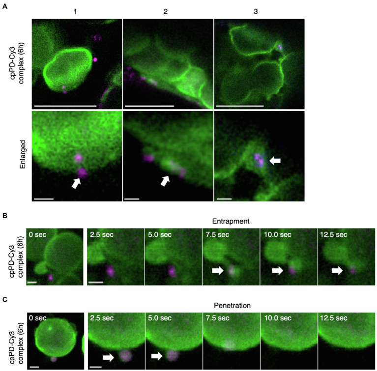

# fine-tune-llama3.2-for-MedVQA
The goal of this project is to fine-tune the LLaMA 3.2 Multimodal model for medical VQA tasks. By leveraging a medical dataset containing images and associated questions and answers, we adapt the model to provide accurate and context-aware responses to medical image queries.

## Dataset

We use the [PMC-VQA](https://huggingface.co/datasets/xmcmic/PMC-VQA) dataset, which consists of medical images from PubMed Central articles, along with questions and answers related to each image.

- **Images**: Medical figures extracted from scientific articles.
- **Questions**: Clinical and technical questions about the images.
- **Answers**: Expert-provided answers to the questions.

## Prerequisites

- Python 3.8 or higher
- PyTorch
- Hugging Face Transformers
- Hugging Face Datasets
- PEFT (Parameter-Efficient Fine-Tuning)
- BitsAndBytes for 4-bit quantization
- PIL (Python Imaging Library)
- Requests
- Zipfile

## Results

|Image| Base Generation       | Fine-tuned Generation            | Correct Answer     |
|---------|------------|-----------------|---------------|
|| **Step 1: Identifying the type of image** The image consists of microscopic pictures showing the penetration of a conjugate (cpPD-Cy3 complex) in cells. The image consists of 3 panels (A, B, and C). **Step 2: Identifying the conjugate** In panel (A), the conjugate is identified as cpPD-Cy3 complex. Panels (B) and (C) show the penetration of cpPD-Cy3 complex over time, in seconds. Panels (B) and (C) have labels with arrows identifying the penetration rate. **Step 3: Conclusion** The images show the penetration of cpPD-Cy3 complex in cells.     | CPD-Cy3 fluorescence.       | Cy3 fluorescence     |

## Acknowledgements

- [LLaMA 3.2 Multimodal](https://huggingface.co/meta-llama/Llama-3.2-11B-Vision-Instruct)
- [PMC-VQA Dataset](https://huggingface.co/datasets/xmcmic/PMC-VQA)
- [Hugging Face Transformers](https://github.com/huggingface/transformers)
- [PEFT Library](https://github.com/huggingface/peft)
- [BitsAndBytes](https://github.com/TimDettmers/bitsandbytes)

## License

This project is licensed under the MIT License. See the [LICENSE](LICENSE) file for details.
